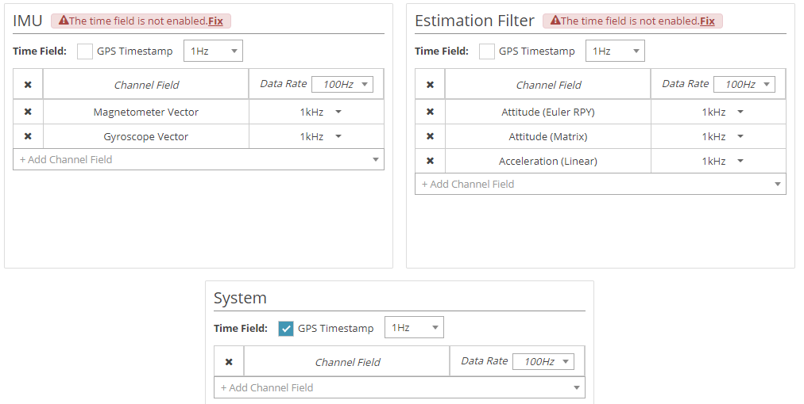

# HRRLab MicroStrain IMU serial communication based node

### Prebuild environment
* OS  (Ubuntu 20.04 LTS)  
* ROS Environment (ROS1 Noetic)  

### Installation
1. sudo apt-get update && sudo apt-get install ros-noetic-microstrain-inertial-driver
2. git clone https://github.com/AsdoubleU/serial_microstrain.git

### IMU Configuration
Install the sensor connect, and set the configuration as below.

### Build examples
1. Put this package in your workspace.
2. catkin_make
3. source your/workspace/path/devel/setup.bash
4. roslaunch microstrain_inertial_listener imu_reading.launch
5. The topics for IMU informatoins are available.